# Load data from World Happiness Report 


```r
# load required library
library(tidyverse)
```

```
## ── Attaching packages ───────────────────────────────────────────────────────── tidyverse 1.2.1 ──
```

```
## ✔ ggplot2 3.0.0     ✔ purrr   0.2.4
## ✔ tibble  1.4.2     ✔ dplyr   0.7.4
## ✔ tidyr   0.8.0     ✔ stringr 1.3.0
## ✔ readr   1.1.1     ✔ forcats 0.3.0
```

```
## ── Conflicts ──────────────────────────────────────────────────────────── tidyverse_conflicts() ──
## ✖ dplyr::filter() masks stats::filter()
## ✖ dplyr::lag()    masks stats::lag()
```

```r
y17 <- read.csv("./data/2017.csv", stringsAsFactors = FALSE)
```


```r
head(y17)
```

```
##       Country Happiness.Rank Happiness.Score Whisker.high Whisker.low
## 1      Norway              1           7.537     7.594445    7.479556
## 2     Denmark              2           7.522     7.581728    7.462272
## 3     Iceland              3           7.504     7.622030    7.385970
## 4 Switzerland              4           7.494     7.561772    7.426227
## 5     Finland              5           7.469     7.527542    7.410458
## 6 Netherlands              6           7.377     7.427426    7.326574
##   Economy..GDP.per.Capita.   Family Health..Life.Expectancy.   Freedom
## 1                 1.616463 1.533524                0.7966665 0.6354226
## 2                 1.482383 1.551122                0.7925655 0.6260067
## 3                 1.480633 1.610574                0.8335521 0.6271626
## 4                 1.564980 1.516912                0.8581313 0.6200706
## 5                 1.443572 1.540247                0.8091577 0.6179509
## 6                 1.503945 1.428939                0.8106961 0.5853845
##   Generosity Trust..Government.Corruption. Dystopia.Residual
## 1  0.3620122                     0.3159638          2.277027
## 2  0.3552805                     0.4007701          2.313707
## 3  0.4755402                     0.1535266          2.322715
## 4  0.2905493                     0.3670073          2.276716
## 5  0.2454828                     0.3826115          2.430182
## 6  0.4704898                     0.2826618          2.294804
```

# Rename column names


```r
names(y17) <- c("country", "rank", "score", "whisker_high", "whisker_low", "gdp", "family", "life_expectancy", "freedom", "generosity", "corruption", "dystopia")
```

# Top 10 happiest country


```r
top10_happy <- head(y17, 10)
```


```r
top10_happy$country <- factor(top10_happy$country, levels = top10_happy$country[order(-top10_happy$score)])

ggplot(top10_happy, aes(x = country, y = score, fill = country)) +
  geom_bar(stat = "identity", aes(width = 0.4)) +
  labs(title = "Top 10 World's Happiest Countries") +
  geom_text(aes(label = round(score, 2)), position = position_stack(vjust = 0.5), size = 3)
```

```
## Warning: Ignoring unknown aesthetics: width
```

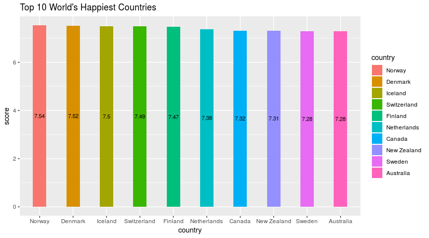<!-- -->

# Least Happy Countries


```r
least10_happy <- tail(y17, 10)

least10_happy$country <- factor(least10_happy$country, levels = least10_happy$country[order(least10_happy$score)])
  
ggplot(least10_happy, aes(x = country, y = score, fill = country)) +
  geom_bar(stat = "identity", aes(width = 0.4)) +
  labs(title = "Top 10 World's Least Happiest Countries") +
  geom_text(aes(label = round(score, 2)), position = position_stack(vjust = 0.5), size = 3)
```

```
## Warning: Ignoring unknown aesthetics: width
```

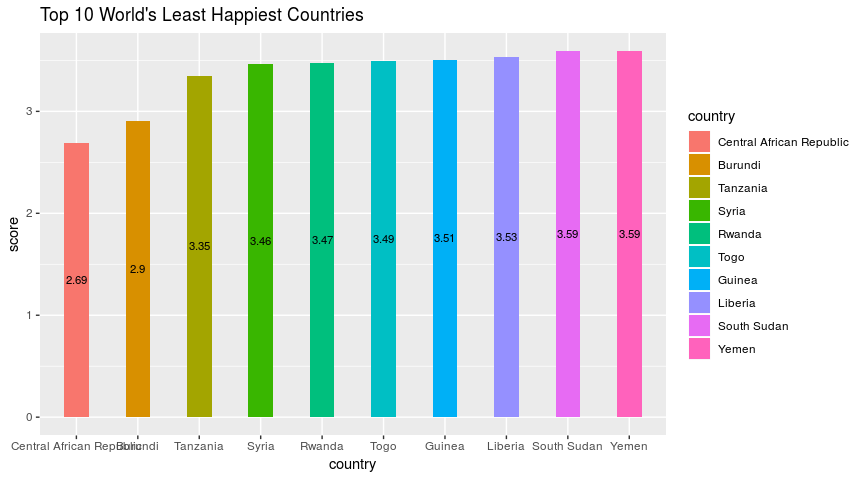<!-- -->

# Add the region in the dataframe


```r
y16 <- read.csv("./data/2016.csv", stringsAsFactors = FALSE)

y16_select <- y16 %>% 
  select(Country, Region)

names(y16_select) <- c("country", "region") 

y17_full <- right_join(y16_select, y17, by = "country")

# check if country has no region
which(is.na(y17_full),arr.ind=TRUE)
```

```
##      row col
## [1,]  33   2
## [2,]  71   2
## [3,] 113   2
## [4,] 139   2
## [5,] 155   2
```

```r
y17_full %>% 
  filter(is.na(region))
```

```
##                    country region rank score whisker_high whisker_low
## 1 Taiwan Province of China   <NA>   33 6.422     6.494596    6.349404
## 2  Hong Kong S.A.R., China   <NA>   71 5.472     5.549594    5.394406
## 3               Mozambique   <NA>  113 4.550     4.774102    4.325898
## 4                  Lesotho   <NA>  139 3.808     4.044344    3.571656
## 5 Central African Republic   <NA>  155 2.693     2.864884    2.521116
##         gdp   family life_expectancy   freedom generosity corruption
## 1 1.4336265 1.384565      0.79398423 0.3614666  0.2583605 0.06382924
## 2 1.5516748 1.262791      0.94306242 0.4909686  0.3744658 0.29393375
## 3 0.2343056 0.870701      0.10665444 0.4807911  0.3222281 0.17943639
## 4 0.5210212 1.190095      0.00000000 0.3906613  0.1574973 0.11909464
## 5 0.0000000 0.000000      0.01877269 0.2708420  0.2808765 0.05656508
##    dystopia
## 1 2.1266074
## 2 0.5546331
## 3 2.3556509
## 4 1.4298353
## 5 2.0660048
```

```r
y17_full$region[c(33, 71, 113, 139, 155)] <- c("Eastern Asia","Eastern Asia", "Sub-Saharan Africa", "Sub-Saharan Africa", "Sub-Saharan Africa")
```

# Summary statistics


```r
y17_full %>% 
  group_by(region) %>% 
  select(region, rank, score, gdp, life_expectancy, corruption) %>% 
  summarise(rank = mean(rank), score = mean(score), gdp = mean(gdp), life_expectancy = mean(life_expectancy), corruption = mean(corruption)) %>% 
  arrange(rank)
```

```
## # A tibble: 10 x 6
##    region                      rank score   gdp life_expectancy corruption
##    <chr>                      <dbl> <dbl> <dbl>           <dbl>      <dbl>
##  1 Australia and New Zealand   9.00  7.30 1.45            0.830     0.342 
##  2 North America              10.5   7.15 1.51            0.804     0.212 
##  3 Western Europe             27.1   6.70 1.46            0.825     0.219 
##  4 Latin America and Caribb…  50.8   5.96 1.01            0.611     0.0878
##  5 Eastern Asia               64.8   5.65 1.32            0.808     0.107 
##  6 Southeastern Asia          73.8   5.44 0.965           0.582     0.128 
##  7 Central and Eastern Euro…  75.1   5.41 1.09            0.636     0.0796
##  8 Middle East and Northern…  76.4   5.37 1.17            0.606     0.149 
##  9 Southern Asia             110.    4.63 0.697           0.457     0.103 
## 10 Sub-Saharan Africa        128.    4.11 0.502           0.225     0.101
```

# Top 50 countries count by region


```r
top_50 <- head(y17_full, 50)

# unique(top_50$region)
# count <- top_50 %>% 
#   group_by(region) %>%
#   count(region)

count <- count(top_50, region)

count$region <- factor(count$region, levels = count$region[order(-count$n)])

ggplot(count, aes(x = region, y = n, fill = region)) +
  geom_bar(stat = "identity", width = 0.5) +
  guides(fill=FALSE) +
  geom_text(aes(label = n), position = position_stack(vjust = 0.5), size = 4) +
  labs(title = "Top 50 countries count by region", y = "Countries count", x = "") +
  theme(axis.text.x = element_text(angle = 90, hjust = 1))
```

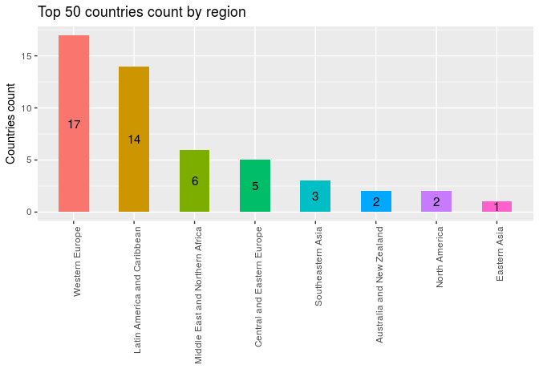<!-- -->

# Heatmap of Data


```r
library(ggplot2)
library(reshape2)
```

```
## 
## Attaching package: 'reshape2'
```

```
## The following object is masked from 'package:tidyr':
## 
##     smiths
```

```r
data <- y17_full %>%
  select(score, gdp, family, life_expectancy, freedom, generosity, corruption, dystopia)
  
# Create correlation matrix
cordata <- round(cor(data),2)

head(cordata)
```

```
##                 score   gdp family life_expectancy freedom generosity
## score            1.00  0.81   0.75            0.78    0.57       0.16
## gdp              0.81  1.00   0.69            0.84    0.37      -0.02
## family           0.75  0.69   1.00            0.61    0.42       0.05
## life_expectancy  0.78  0.84   0.61            1.00    0.35       0.06
## freedom          0.57  0.37   0.42            0.35    1.00       0.32
## generosity       0.16 -0.02   0.05            0.06    0.32       1.00
##                 corruption dystopia
## score                 0.43     0.48
## gdp                   0.35     0.02
## family                0.23     0.07
## life_expectancy       0.28     0.05
## freedom               0.50     0.08
## generosity            0.29    -0.12
```

```r
# reshape the data correlation values in two axis
melted_cordata <- melt(cordata)
head(melted_cordata)
```

```
##              Var1  Var2 value
## 1           score score  1.00
## 2             gdp score  0.81
## 3          family score  0.75
## 4 life_expectancy score  0.78
## 5         freedom score  0.57
## 6      generosity score  0.16
```

```r
ggplot(data = melted_cordata, aes(Var2, Var1, fill = value, label = value))+
 geom_tile(color = "white") + 
 scale_fill_gradient2(low = "blue", high = "red", mid = "white", 
   midpoint = 0, limit = c(-1,1), space = "Lab", 
   name="Correlation") +
  theme_minimal() + 
  labs(title = "Correlation Matrix of Data", x = "", y = "") +
 theme(axis.text.x = element_text(angle = 90, vjust = 1, 
    size = 11, hjust = 1), 
    axis.text.y = element_text(vjust = 1, 
    size = 11, hjust = 1))+
   geom_text(size = 3) +
   
 coord_fixed()
```

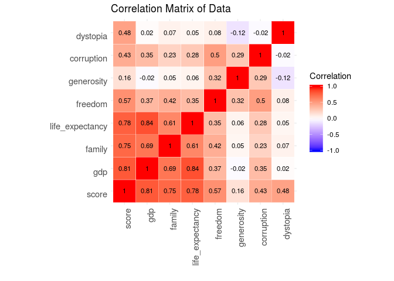<!-- -->

# South Asian Countries - Happiness Bar


```r
south_asia <- y17_full %>%
  group_by(region) %>% 
  select(country, rank, score, gdp, family, life_expectancy, freedom, generosity, corruption, dystopia) %>% 
  filter(region == "Southern Asia") 
```

```
## Adding missing grouping variables: `region`
```

```r
south_asia$country <- factor(south_asia$country, levels = south_asia$country[order(-south_asia$score)])

ggplot(south_asia, aes(x = country, y = rank, fill = country)) +
  geom_bar(stat = "identity", width = 0.6) +
  geom_text(aes(label = rank), position = position_stack(vjust = 0.7), size = 3) +
  labs(title = "World Happiness Rank - South Asian Countries") +
  theme(plot.title = element_text(hjust = 0.5)) 
```

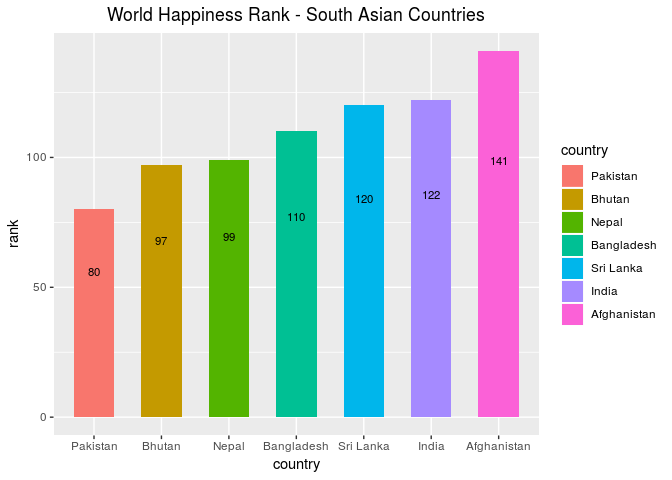<!-- -->

```r
ggplot(south_asia, aes(x = country, y = score, fill = country)) +
  geom_bar(stat = "identity", width = 0.6) +
  geom_text(aes(label = round(score, 2)), position = position_stack(vjust = 0.7), size = 3.5) +
  labs(title = "World Happiness Score - South Asian Countries") +
  theme(plot.title = element_text(hjust = 0.5)) 
```

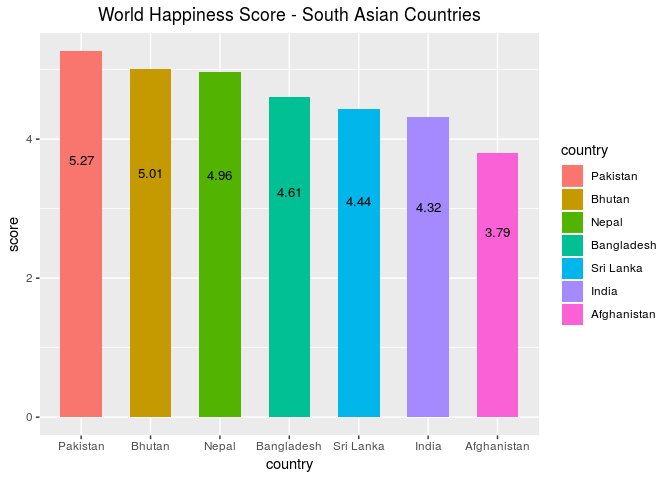<!-- -->

```r
ggplot(south_asia, aes(x = country, y = gdp, fill = country)) +
  geom_bar(stat = "identity", width = 0.6) +
  geom_text(aes(label = round(gdp, 2)), position = position_stack(vjust = 0.7), size = 3.5) +
  labs(title = "Economy GDP of South Asian Countries") +
  theme(plot.title = element_text(hjust = 0.5)) 
```

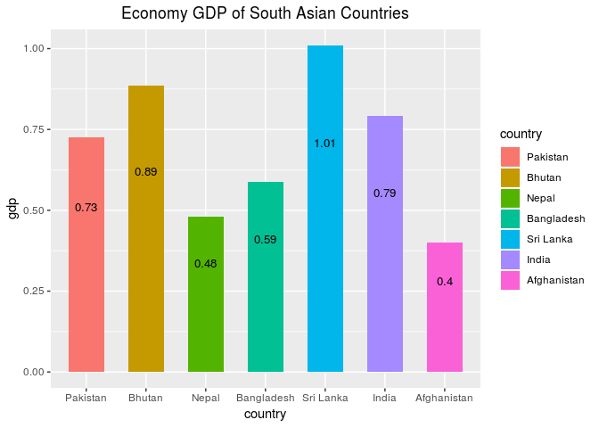<!-- -->

```r
ggplot(south_asia, aes(x = country, y = corruption, fill = country)) +
  geom_bar(stat = "identity", width = 0.6) +
  geom_text(aes(label = round(corruption, 2)), position = position_stack(vjust = 0.7), size = 3.5) +
  labs(title = "Corruption Score of South Asian Countries") +
  theme(plot.title = element_text(hjust = 0.5)) 
```

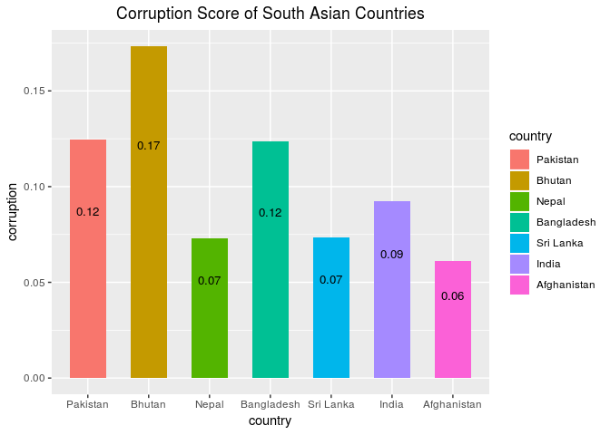<!-- -->

```r
ggplot(south_asia, aes(x = country, y = life_expectancy, fill = country)) +
  geom_bar(stat = "identity", width = 0.6) +
  geom_text(aes(label = round(life_expectancy, 2)), position = position_stack(vjust = 0.7), size = 3.5) +
  labs(title = "Life Expectancy of South Asian Countries ") +
  theme(plot.title = element_text(hjust = 0.5)) 
```

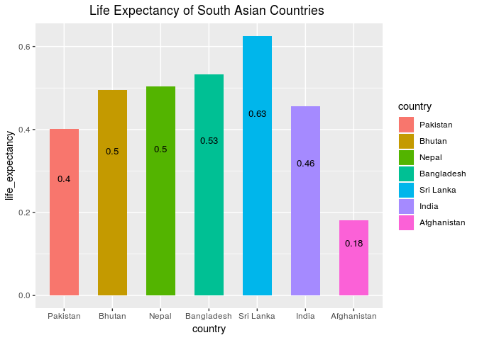<!-- -->


```r
count <- count(y17_full, region)

count <- count %>% 
  mutate(percent = round(n/sum(n) * 100, 2))

count
```

```
## # A tibble: 10 x 3
##    region                              n percent
##    <chr>                           <int>   <dbl>
##  1 Australia and New Zealand           2    1.29
##  2 Central and Eastern Europe         29   18.7 
##  3 Eastern Asia                        6    3.87
##  4 Latin America and Caribbean        22   14.2 
##  5 Middle East and Northern Africa    19   12.3 
##  6 North America                       2    1.29
##  7 Southeastern Asia                   8    5.16
##  8 Southern Asia                       7    4.52
##  9 Sub-Saharan Africa                 39   25.2 
## 10 Western Europe                     21   13.6
```

```r
ggplot(count, aes(x="", y = percent, fill=region)) + 
  geom_bar(width = 1, stat = "identity") +
  labs(title="No. of countries in regional chart", caption= "", y = "" , x = "") +
  geom_text(aes(label = n), position = position_stack(vjust = 0.5), size = 2.5) +
  coord_polar(theta="y") +
  theme_grey()
```

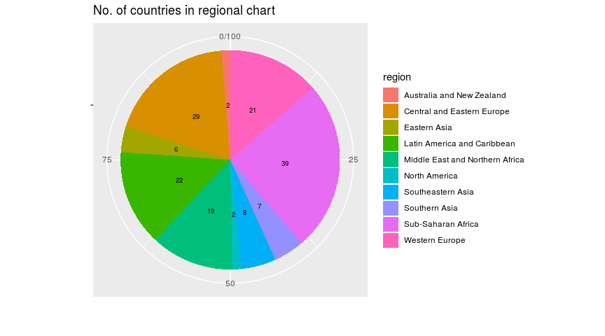<!-- -->

# Happiness Score vs Region


```r
ggplot(y17_full, aes(x = region, y = score, fill = region)) +
  geom_bar(stat = "identity") +
   theme_minimal() +
  theme(axis.text.x=element_blank()) 
```

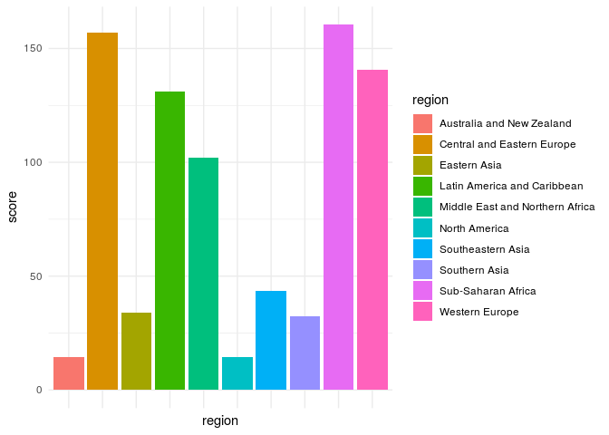<!-- -->


# Economy vs Region


```r
ggplot(y17_full, aes(x = region, y = gdp, fill = region)) +
  geom_bar(stat = "identity") +
   theme_minimal() +
  theme(axis.text.x=element_blank()) 
```

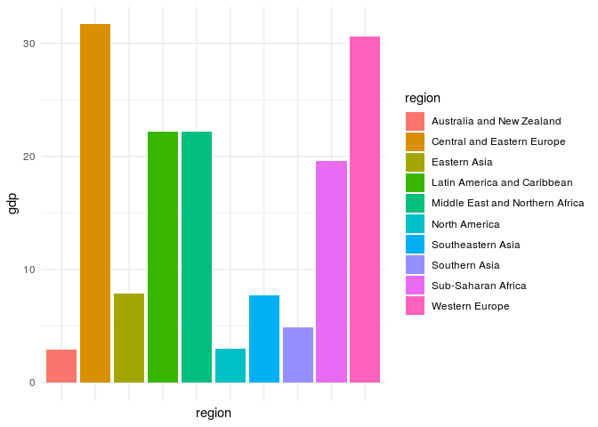<!-- -->

# Life Expectancy vs Region


```r
ggplot(y17_full, aes(x = region, y = life_expectancy, fill = region)) +
  geom_bar(stat = "identity") +
   theme_minimal() +
  theme(axis.text.x=element_blank()) 
```

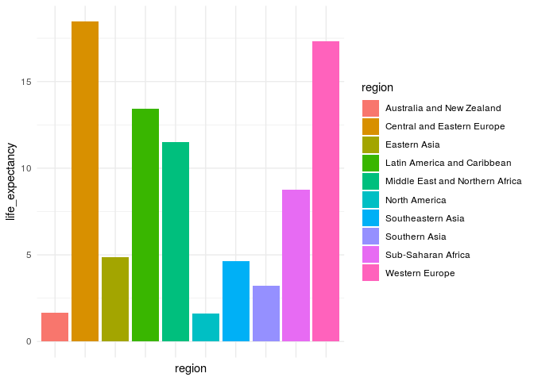<!-- -->

# Corruption vs Region


```r
ggplot(y17_full, aes(x = region, y = corruption, fill = region)) +
  geom_bar(stat = "identity") +
   theme_minimal() +
  theme(axis.text.x=element_blank()) 
```

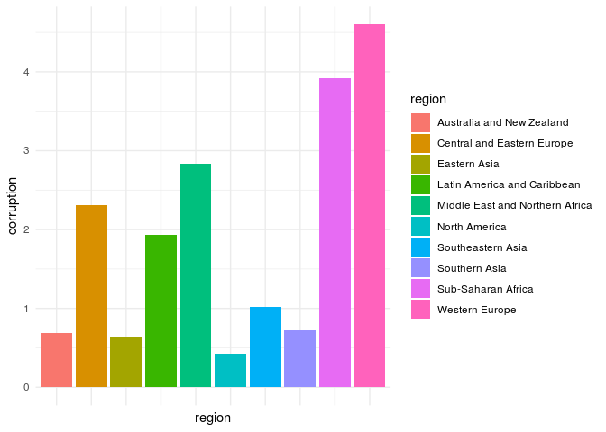<!-- -->

